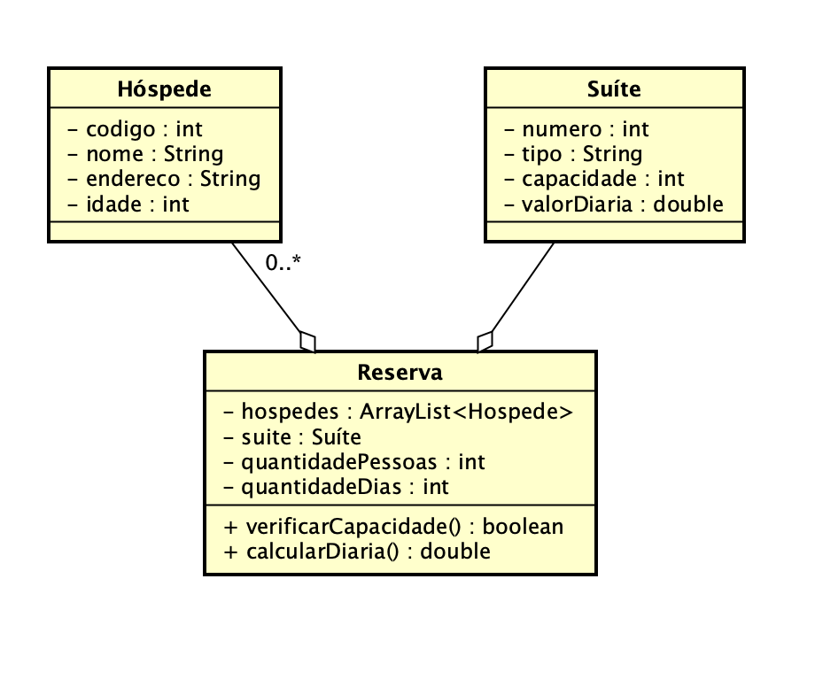

# Unicesumar
###### CURSO: _SUPERIOR DE TECNOLOGIA EM ANÁLISE E DESENVOLVIMENTO DE SISTEMAS_
###### DISCENTE: _ANTHONY VICTOR RAMOS COSTA_
###### DISCIPLINA: _PROGRAMAÇÃO 3 - MÓDULO 51/2022_

### Material de avaliação prática - M.A.P.A.
 
❇️ Olá, este MAPA tem por objetivo por em prática a ***análise e o desevolvimento*** visto durante as nossas aulas, para isso analise e implemente a situação a seguir:

Imagine que você trabalha como desenvolvedor de sistemas em uma fábrica de software que tem como novo cliente o dono de um hotel que foi recém inaugurado. 

O hotel necessita de um **sistema de reserva** de hospedagem para gestão das vagas nas suíte.
O ***analista de sistemas*** já fez a modelagem do sistema como demonstrado abaixo:

#### Especificações do app
- Crie um programa que utilize a **orientação objeto** em Java na IDE Netbeans.
- A reserva não pode alocar mais hóspedes do que a capacidade da suíte.
- Bebês até 2 anos não contam na capacidade da suíte.
- Para o cálculo da diária, multiplique o valor da diária da suíte pela quantidade de diárias solicitadas.
- Para uma reserva com mais de 7 dias, deverá ser concedido um desconto de 10%.
- Não necessita de interface para entrega.
- Poderá ser criado uma classe "Main" que instancie e execute os objetos e métodos para o teste das funcionalidades.

HOTEL X.
SISTEMA DE RESERVA
-

| MENU PRINCIPAL 🏠
|-|
| 1 - NOVA RESERVA
| 0 - FINALIZAR

>- 1 - Exibe a tela *SELEÇÃO DE SUÍTE*. ✅
>- 0 - Finaliza o app. ✅

SUÍTES 🛏️
-
| Nº | NOME | CAPACIDADE | DIARIA |
|:-|:-|:-|:-|
| 1 | SUITE X | ? PESSOAS | R$ 000,00
| 2 | SUITE Y | ? PESSOAS | R$ 000,00
| 3 | SUITE Z | ? PESSOAS | R$ 000,00

| INCLUIR HÓSPEDE 👨‍💼 |
|-|
| NOME?: _
| ENDEREÇO?: _
| IDADE?: _
| REPETIR OPERAÇÃO (S/N)?: _

| CONCLUIR RESERVA 🛌 |
|-|
| QTD DIAS?: _
| CONFIRMA RESERVA (S/N)?: _

| RESERVA EFETUADA ✅ |
|-|
| SUÍTE: 
| HÓSPEDES:
| DIAS RESERVADOS:
| VALOR DESCONTO: 
| VALOR FINAL:

>- Exibe todas as suítes disponíveis para reserva e suas informações. ✅
>- Lê o número da suíte desejada. ✅
>- Lê o dados dos hóspedes. ✅
>- Lê a quantidade de dias à serem reservados. ✅
>- Confirmar antes de efetuar a reserva. ✅
>- Exibir dados da reserva efetuada. ✅
>- Exibir valor final da reserva, e o desconto, caso seja aplicado. ✅

| Nota/Valor | Descrição dos critérios |
|---------|:---------------:
| 1,00 / 1,00 | 1. MODELAGEM DE CLASSES ✅
| 1,50 / 1,50 | 2. REGRAS DE NEGÓCIO ✅
| 1,00 / 1,00 | 2. TESTES NO MÉTODO MAIN ✅
| 3,50 / 3,50 | Nota final ✅
